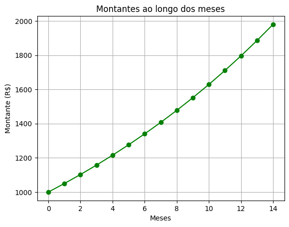

# O valor do dinheiro no tempo

Juros compostos são uma aplicação prática de progressão geométrica.
A relação entre **progressão geométrica (PG)** e **juros compostos** é muito próxima, pois ambos envolvem o conceito de crescimento exponencial. Quando trabalhei no banco, notei essa proximidade, mas nunca me detive cuidadosamente para pesquisar a respeito. Agora, vamos explorar essa conexão mais de perto.


### **Progressão Geométrica (PG)**
Uma progressão geométrica é uma sequência numérica em que cada termo, a partir do segundo, é obtido multiplicando o termo anterior por uma constante chamada **razão** ($q$). A fórmula geral para o $n$-ésimo termo de uma PG é dada por:

$$
a_n = a_1 \cdot q^{n-1}
$$

Onde:
- $a_n$: é o $n$-ésimo termo da PG.
- $a_1$: é o primeiro termo.
- $q$: é a razão da PG.
- $n$: é a posição do termo na sequência.

Essa fórmula descreve um crescimento exponencial quando $q > 1$, ou um decrescimento exponencial quando $0 < q < 1$.


### **Juros Compostos**
Nos juros compostos, o valor acumulado ao longo do tempo cresce de forma exponencial porque os juros gerados em cada período são incorporados ao capital inicial, e os juros dos períodos seguintes são calculados sobre esse novo valor.

A fórmula para o montante ($M$) após $n$ períodos é:

$$M = C \cdot (1 + i)^n$$

Onde:
- $M$: é o montante final (capital mais juros acumulados).
- $C$: é o capital inicial.
- $i$: é a taxa de juros por período (expressa em decimal).
- $n$: é o número de períodos.


### **Relação entre PG e Juros Compostos**
Agora, observe as semelhanças entre as duas fórmulas:

- Na PG: $a_n = a_1 \cdot q^{n-1}$
- Nos juros compostos: $M = C \cdot (1 + i)^n$

Ambas descrevem um crescimento exponencial, onde:
- O **primeiro termo da PG ($a_1$)** corresponde ao **capital inicial ($C$)** nos juros compostos.
- A **razão da PG ($q$)** corresponde ao **fator de crescimento $(1 + i)$** nos juros compostos.
- O **expoente ($n-1$ ou $n$)** indica o número de períodos ou etapas no processo de crescimento.

Portanto, o cálculo do montante em juros compostos pode ser visto como uma aplicação prática de uma progressão geométrica, onde:
- O capital inicial ($C$) é o primeiro termo da sequência.
- O fator $(1 + i)$ é a razão da PG.
- O montante ($M$) é o termo correspondente à posição $n$ na sequência.


### **Exemplo numérico**
Suponha que você invista $C = 1000$ reais a uma taxa de juros compostos de $5\%$ ao mês ($i = 0,05$). Qual será o montante após 3 meses?

Usando a fórmula de juros compostos:
$$
M = 1000 \cdot (1 + 0,05)^3 = 1000 \cdot 1,157625 = 1157,63 \, \text{reais}.
$$

Agora, vejamos isso como uma PG:
- Primeiro termo ($a_1$): $1000$.
- Razão ($q$): $1 + 0,05 = 1,05$.
- Terceiro termo ($a_3$):
$$
a_3 = 1000 \cdot (1,05)^3 = 1157,63 \, \text{reais}.
$$

Os resultados são idênticos, mostrando que o cálculo de juros compostos segue o mesmo padrão de uma progressão geométrica.


### **Crescimento exponencial**
A relação entre progressão geométrica e juros compostos está no fato de que ambos descrevem processos de crescimento exponencial. Nos juros compostos, o montante acumulado ao longo do tempo pode ser interpretado como os termos de uma progressão geométrica, onde o capital inicial é o primeiro termo e o fator $(1 + i)$ é a razão da PG.

### **Exemplos de código em Python**

A seguir vamos apresentar um código em Python para exemplificar, passo a passo, a relação entre progressão geométrica (PG) e juros compostos. 


### Passo 1: Introdução ao problema
Nosso objetivo é criar um programa que:
1. Modele uma **Progressão Geométrica** genérica.
2. Use essa PG para calcular **juros compostos**, que seguem a mesma lógica exponencial.
3. Permita visualizar os resultados por meio de gráficos dinâmicos.

Vamos começar criando a classe base para representar uma PG.

### Passo 2: Criando a Classe `ProgressaoGeometrica`

**Implementação da Classe**

Vamos criar uma classe chamada `ProgressaoGeometrica` com os seguintes métodos:
- `__init__`: inicializa a PG com o primeiro termo ($a_1$) e a razão ($q$).
- `calcular_termo`: calcula o $n$-ésimo termo da PG.
- `gerar_sequencia`: gera uma lista com os primeiros $n$ termos da PG.


```python
class ProgressaoGeometrica:
    def __init__(self, primeiro_termo, razao):
        """
        Inicializa uma progressão geométrica.
        
        :param primeiro_termo: o primeiro termo da PG (a1).
        :param razao: a razão da PG (q).
        """
        self.primeiro_termo = primeiro_termo
        self.razao = razao

    def calcular_termo(self, n):
        """
        Calcula o n-ésimo termo da progressão geométrica.
        
        :param n: posição do termo na sequência (n >= 1).
        :return: valor do n-ésimo termo.
        """
        if n < 1:
            raise ValueError("A posição 'n' deve ser maior ou igual a 1.")
        return self.primeiro_termo * (self.razao ** (n - 1))

    def gerar_sequencia(self, num_termos):
        """
        Gera uma lista com os primeiros 'num_termos' da PG.
        
        :param num_termos: número de termos a serem gerados.
        :return: lista contendo os termos da PG.
        """
        if num_termos < 1:
            raise ValueError("O número de termos deve ser maior ou igual a 1.")
        return [self.calcular_termo(n) for n in range(1, num_termos + 1)]
```

### Testando a Classe
Vamos testar a classe para ver se ela funciona corretamente.


```python
# Instanciando a classe
pg = ProgressaoGeometrica(primeiro_termo=2, razao=2)

# Calculando o 6º termo
termo_6 = pg.calcular_termo(6)
print(f"6º termo da PG: {termo_6}") 

# Gerando os primeiros 6 termos
sequencia = pg.gerar_sequencia(6)
print(f"Sequência dos primeiros 6 termos: {sequencia}")  
```

    6º termo da PG: 64
    Sequência dos primeiros 6 termos: [2, 4, 8, 16, 32, 64]


### Passo 3: Criando a Classe `JurosCompostos`

**Implementação da Classe**

Vamos criar uma classe `JurosCompostos` que herda de `ProgressaoGeometrica`. Essa classe usará a lógica da PG para calcular montantes. Usamos a função embutida do Python **super()**, que permite acessar métodos da classe pai sem precisar mencionar explicitamente o seu nome. Dessa forma, a classe `JurosCompostos` herda corretamente os atributos e métodos da classe `ProgressaoGeometrica`. 


```python
class JurosCompostos(ProgressaoGeometrica):
    def __init__(self, capital_inicial, taxa_juros):
        """
        Inicializa uma instância de juros compostos, que é uma PG específica.
        
        :param capital_inicial: Capital inicial (C), equivalente ao primeiro termo da PG.
        :param taxa_juros: Taxa de juros por período (i), usada para calcular a razão (1 + i).
        """
        razao = 1 + taxa_juros  # Fator de crescimento (1 + i)
        super().__init__(primeiro_termo=capital_inicial, razao=razao)

    def calcular_montante(self, num_periodos):
        """
        Calcula o montante após 'num_periodos' períodos.
        
        :param num_periodos: número de períodos (n).
        :return: Montante acumulado após 'num_periodos'.
        """
        return self.calcular_termo(num_periodos + 1)  # O montante é o (n+1)-ésimo termo.
```

### Testando a Classe
Vamos testar a classe `JurosCompostos`.


```python
# Instanciando a classe
jc = JurosCompostos(capital_inicial=1000, taxa_juros=0.05)

# Calculando o montante após 3 meses
montante_3_meses = jc.calcular_montante(3)
print(f"Montante após 3 meses: R$ {montante_3_meses:.2f}") 

# Gerando a sequência de montantes para 5 meses
sequencia_montantes = jc.gerar_sequencia(5)
print(f"Sequência de montantes: {sequencia_montantes}")  
```

    Montante após 3 meses: R$ 1157.63
    Sequência de montantes: [1000.0, 1050.0, 1102.5, 1157.6250000000002, 1215.5062500000001]


### Passo 4: Adicionando gráficos dinâmicos

**Por que Gráficos?**

Gráficos ajudam a visualizar o crescimento exponencial dos montantes ao longo do tempo. Vamos usar a biblioteca `matplotlib` para gerar gráficos dinâmicos:
- **Gráfico de barras**: Para até 12 meses.
- **Gráfico de linha**: Para mais de 12 meses.

**Implementação da função**

Adicionamos a função `gerar_grafico` ao código.


```python
import matplotlib.pyplot as plt

def gerar_grafico(periodos, montantes):
    """
    Gera um gráfico de barras ou linha com base no número de períodos.
    
    :param periodos: lista de períodos (meses).
    :param montantes: lista de montantes correspondentes aos períodos.
    """
    if len(periodos) <= 12:
        # Gráfico de barras
        plt.bar(periodos, montantes, color='skyblue', edgecolor='black')
        plt.title("Montantes ao longo dos meses")
    else:
        # Gráfico de Linha
        plt.plot(periodos, montantes, marker='o', color='green', linestyle='-')
        plt.title("Montantes ao longo dos meses")
    
    plt.xlabel("Meses")
    plt.ylabel("Montante (R$)")
    plt.grid(True)
    plt.show()
```

### Testando o gráfico
Vamos gerar um gráfico para 15 meses.


```python
# Gerando a sequência de montantes para 15 meses
sequencia_montantes = jc.gerar_sequencia(15)
periodos = list(range(len(sequencia_montantes)))

# Gerando o gráfico
gerar_grafico(periodos, sequencia_montantes)
```


    

    


### Conclusão

No passo a passo, aprendemos:
1. A relação entre **Progressão Geométrica** e **Juros Compostos**.
2. Como criar uma classe genérica para modelar uma **PG**.
3. Como usar herança para criar uma classe específica para **Juros Compostos**.
4. Como adicionar funcionalidades extras, como gráficos dinâmicos, para melhorar a visualização dos resultados.

**Fontes:**

https://fintechpython.pages.oit.duke.edu/jupyternotebooks/1-Core%20Python/answers/rq-26-answers.html

https://python-programming.quantecon.org/python_oop.html

**Referências:**

Wang, H. (2023). *Introduction to computer programming with Python*.
Published by Remix, an imprint of Athabasca University Press. DOI: https://doi.org/10.15215/remix/9781998944088.01
